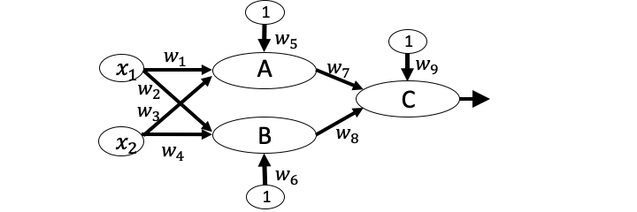

# Coding (6 points)

Your task is to implement the Gradient Descent algorithm. You will write the following code:

 - Two types of Lp regularization and their gradients (in `your_code/regularization.py`)
 - Two loss functions and their gradients (in `your_code/loss.py`)
 - The Gradient Descent algorithm (in `your_code/gradient_descent.py`)

**Note**: In order to pass the Gradient Descent tests, you must download the MNIST dataset first. See the MNIST dataset section for more instructions.

Note that this is also the order in which we recommend you implement the code for this homework.

Your goal is to pass the test suite (contained in `tests/`). Once the tests are passed, you may move on to the next part - reporting your results.

Your grade for this section is defined by the autograder. If it says you got an 80/100, you get 80% of the points.

## The MNIST dataset
The MNIST dataset of handwritten digits is used for this assignment. You can read more about it and download it [here](http://yann.lecun.com/exdb/mnist/). You must download all 4 files (the training images, training labels, testing images, and testing labels). Please unzip these files and store the unzipped files in `data/`. Note that these files are not pushed to GitHub, so you will need to repeat this process for each computer that you use to work on this assignment. In general, large files should not be stored in GitHub repositories. For all data loading in this assignment, use the `load_data` function that we have provided in `load_data.py`.
*Hint*: use the `gzip` tool to unzip the data.

# Free-response questions (14 points)

To answer some of the free-response questions, you will have to write extra code (that is not covered by the test cases). You may include your experiments in new files in the `experiments` directory. See `experiments/example.py` for an example. You can run any experiments you create within this directory with `python -m experiments.<experiment_name>`. For example, `python -m experiments.example` runs the example experiment.

## 1. (1.25 points) Visualizing Gradient Descent

a. (0.5 points) Setup an experiment to classify the `mnist-binary` dataset (see `load_data.py` for more on that dataset) using the Gradient Descent learner. Use `fraction=1` when calling `load_data`. For your loss function, use `hinge` loss and set the learning rate (i.e., lambda) to `1e-4`. Keep all other Gradient Descent parameters as their defaults. After each training iteration through the dataset (using Batch Gradient Descent on just the training data), compute both the loss and accuracy of the model on the full training dataset. Terminate after convergence or after 1000 iterations (i.e., `max_iter = 1000`). Construct and include two (labeled) plots: the loss and accuracy at each iteration. Note that when `batch_size` is not set, it trains on all available training data for each step.

b. (0.5 points) Repeat the previous experiment, but this time using Stochastic Gradient Descent (i.e., we accomplish this by changing `batch_size` to `64`). Compute and plot the loss and accuracy over the entire dataset after each *epoch*. One epoch is one iteration through the entire dataset. Note that you will need to increase the value of `max_iter` to do this. For example, if we have 500 examples, setting `max_iter=500` and `batch_size=1` would result in one epoch of Stochastic Gradient Descent. Terminate after convergence or after 1000 epochs. Construct and include the two (labeled) plots of the loss and accuracy at each epoch.

c. (0.25 points) Compare the plots generated from Batch Gradient Descent and Stochastic Gradient Descent. Which one seems to need fewer iterations to train? Which one converges to a lower average loss on the training data? Are there differences in the behavior of the loss and accuracy throughout training?

## 2. (1.25 points) Loss Landscapes and the Effects of Batching
a. (0.5 points) Here we will setup an experiment that will allow us to visualize the loss landscape of the `synthetic` dataset (see `load_data.py` for more on that dataset). Here, we define the "loss landscape" as the loss at every  value of the model parameters with respect to our input data. For more information about loss landscapes see the lectures slides for Gradient Descent. For this experiment, we will be looking at the loss landscape of a model with only bias terms, meaning all other parameters have values of exactly 1. Note that this model does not do any "learning" because we are setting the weights explicitly (this means you will not be using your `fit()` function). In your experiment, first load the `synthetic` dataset (with `fraction=1`). Using only the bias term, determine the 0-1 loss over the entire dataset by explicitly setting your bias values to `np.linspace(-5.5, 0.5, 100)`, or 100 equally spaced values between -5 and 0.5. Construct a plot of the loss landscape by plotting the bias on the X axis and the loss on the Y axis. Include your (labeled) plot and describe the minima of the loss landscape.

b. (0.5 points) Now we will examine how the loss landscape changes when you select data differently. By analyzing the `synthetic` dataset and the loss landscape plot you have generated, select a set of 4 points from the dataset that, if you optimize considering only that set, cause the global minimum of the loss landscape to shift. Repeat your experiment from part (a) on this set of 4 points, plot the resulting loss landscape and compare it to the loss landscape from part (a).

c. (0.25 points) Based on your answers from part (a) and (b), explain what effect batching can have on the loss landscape and the convergence of Gradient Descent.

## 3. (1.5 points) Regularization and Feature Selection
a. (1 point) Here we will explore the use of regularization as a means of feature selection. Setup an experiment using the `mnist-binary` dataset. Use `fraction=1` when calling `load_data`. Run Gradient Descent on the `mnist-binary` training dataset using squared loss, using both `l1` and `l2` regularization. Set the step size, or `learning_rate`, to `1e-5` and the maximum number of iterations to `2000`, and set the loss to 'squared'. Report your values for how many digits from each class you used (i.e. what is the size and composition of your training set) and what your batch size was. For each regularizer, run the algorithm  once for each of the following values for lambda: [1e-3, 1e-2, 1e-1, 1, 10, 100]. Plot the number of non-zero model weights from the learned model for each value of lambda. (Here we define non-zero values as values whose absolute value is greater than some `epsilon`, where `epsilon = 0.001`.) Plot both regularizers on one plot. Include your (labeled) plot and describe the trend in non-zero parameters for each regularizer.

b. (0.5 points) If I want to preferentially reduce really large parameters should I use an L2 regularizer or an L1 regularizer? Explain your reasoning. 

## 4. (1 point) Gradient Clipping
Watch [this video](https://www.youtube.com/watch?v=Rc0AN_PzyE0) and answer the following questions.

a. (0.25 points) What causes exploding gradients?

b. (0.25 points) How can we mitigate the effect of exploding gradients? Give a full sentence answer.

C. (0.25 points) What are the issues with the solution described in B?

d. (0.25 points) What is a good way to solve the issues you mentioned in C?

## 5. (2 points) The expressive power of linear networks
 The professor asserted that a single linear model producing a label estimate using the function 
*f*(**x**) = **w***T***x**
has as much expressive power as an arbitrary number of linear models combined in a network. In your answer, you will prove or disprove this statement. Consider the network model below. Nodes A,B, and C all have the linear activation function described above.

a.  (0.5 points) Express the function calculated by node C by spelling out the linear combination of scalars implied by the matrix notation *f*C(**x**) = **w***T***x**. Use *f*A(**x**) to stand for the output of node A and Use *f*B(**x**) for the output of node B.

b. (0.5 points) Expand A and B by expressing them as functions of their input in the same way as you did for node C.

c. (0.5 points) Can you recombine your terms to write *f*C as (weights)+(weights)x1 + (weights)x2  ? If so, show it. If not, say why not.

d. (0.4 points) What does this say about the expressive power of the network compared to a single node?

## 6. (2 points) The expressive power of sigmoid networks
Let's do the exercise from question 4 again, but this time instead of a linear activation function for each node in our network, we'll use the sigmoid function.  *s*(*z*)=(1+*e*-z)-1,  where **z** = **w***T***x** 

a. (0.5 points) Express the function calculated by node *C* in terms of nodes *A* and *B*.

b. (0.5 points) Expand  *A* and *B* by expressing them as functions of their input in the same way as you did for node *C*.

c. (0.5 points) Can you recombine your terms into a form where it looks like a single sigmoid function?. If not, say why not. If so, show it. 

d. (0.5  points) What this says about the expressive power of the network compared to a single node? 

### *NOTE: For problems 7 and 8, you are free to use anything in [scikit-learn](https://scikit-learn.org/stable/), a widely-used library for machine learning in Python. This includes cutting/pasting/repurposing code from examples.*

## 7. (3 points) MNIST with a Neural Net
With scikit-learn it is easy to train a [multi-layer perceptron](https://scikit-learn.org/stable/modules/neural_networks_supervised.html) to [classify the digits in the full MNIST dataset](https://scikit-learn.org/stable/auto_examples/neural_networks/plot_mnist_filters.html#sphx-glr-auto-examples-neural-networks-plot-mnist-filters-py). Perform the following experiments. Don't forget to put **clearly commented** code for these experiments in the 'experiments' folder.

a. (1 point) Do an examination of how many nodes you should use in the hidden layer to learn the full 10-digit MNIST problem.  Use the defaults for all values except *hidden_layer_sizes*. Make 5 networks, each with a single hidden layer. Try each of the following hidden layer sizes:  1, 4, 16, 64, 256. Train all networks on the same training/test split. Get the accuracy. Repeat this 10 times. Report the mean and standard deviation of the accuracy of every network.

b. (1 point) Use the best network architecture from part A. Now we'll try varying the activation function. Perform the same experiment as in part A, but instead of varying architecture try each of the following activation functions {‘identity’, ‘logistic’, ‘tanh’, ‘relu’}. 

c. (1 point) Now that you've got the best network size and activation function, see if you can regularize it. Use your best hidden layer size. Use the best activation function. Perform the same experiment as in part A. but instead of varying architecture, vary the L2 regularization term (you'll have to find it in the docs) by powers of 10:  {1,.1,.01,.001,.001}.

## 8. (2 points) Visualizing your network
a. (1 point) Pick the best network you found from question 7 and visualize its hidden layer. Go back and look at the links in question 7 if you don't know how to do that.

b. (1 point) Describe what patterns you see. Are there any digits that are obvious? Any other patterns? What do you think the network is using to make its choices?

