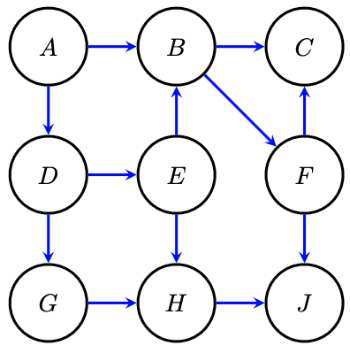

# Coding (12 points)

You will implement two versions of a Naive Bayes classifier.
In `src/naive_bayes.py`, the `NaiveBayes` classifier considers the case where all the data is labeled.
The `NaiveBayesEM` classifier will use the Expectation Maximization algorithm to also learn from unlabeled data.
In `src/utils.py`, you will also write the softmax function, making sure that it is numerically stable.

The lecture slides, as well as [the reading that describes the Naive Bayes EM algorithm](
https://nucs-349-fall21.github.io/readings/collins_naive_bayes.pdf) will be helpful.
We have also provided extensive documentation in the provided code, please read it carefully!
For example, when implementing the `NaiveBayesEM` classifier, be careful to correctly initialize your parameters
(such that all probabilities are equal) and correctly update your inferred class distribution during
the E-step (do not overwrite the observed labels with your predicted probabilities).

Your goal is to pass the test suite that is run by `python -m pytest`.
Once the tests are passed, you may move on Q1 and Q2 below. Q3 and Q4 below do not
depend on you having finished the coding portion of the assignment.

Your grade for this section is defined by the autograder. If it says you got an
80/100, you get 80% of the points.  If your code does not run on our autograder
with `python -m pytest` or you do not include your netid in your submitted
code, you may get a zero for the coding portion!

## The speeches dataset

The dataset provided in `data/speeches.zip` (which should be automatically unzipped by the `src/data.py` code)
contains [State of the Union addresses](https://en.m.wikisource.org/wiki/Portal:State_of_the_Union_Speeches_by_United_States_Presidents)
by United States presidents dating back to 1790. In recent history (specifically, since the Civil Rights Act of 1964),
all US presidents have belonged to one of two political parties, which have remained relatively ideologically stable.

In this data, we treat the words of each speech as the features, and the political party of the speaker as the label.
For presidents prior to 1964, we will treat their party membership as unobserved, as it does not necessarily correspond
to today's two-party system. The `NaiveBayes` classifier will only consider fully-labeled data -- it cannot
use speeches prior to 1964. The `NaiveBayesEM` classifier will also use unlabeled speeches to learn its probabilities.

# Free-response questions (8 points)

To answer some of the free-response questions, you may have to write extra code
(that is not covered by the test cases).  You do *not* have to submit any code
that you write for these questions! If you do add such code to your repository,
double-check that the final version of your default branch code can run
`python -m pytest` with only the provided imports in `requirements.txt`.

## 1. Comparing Naive Bayes with and without unlabeled data (1 points)

See `src.free_response` for code that will help you with part (a) and (b).

Create a dataset using the provided `src.data.build_dataset` function with args `n_docs=100`, `max_words=2000`, and `vocab_size=1000`.
You do not need to split this dataset into train and test splits. Instead, you will fit both
your `NaiveBayes` and `NaiveBayesEM` models on the `data` matrix and `labels` array returned by this function.
For (a) and (b) below, evaluate your models on the entire dataset and add your results to this table.

| Model | Accuracy | Log Likelihood |
| ---   | ---      | ---  |
| NB    |          |      |
| NB+EM |          |      |

(a) Use each fit model to predict labels for each labeled (post-1964) speech.
Calculate the accuracy of each model's predictions and include them in the table above.
Unlabeled speeches (`labels == np.nan`) should not factor into this accuracy calculation
for either model.

(b) Calculate the log likelihood of the entire dataset according each model and include it in the table above.
Unlabeled examples should not contribute to the likelihood of the non-EM model.

(c) Discuss the differences in accuracy and likelihood between the `NaiveBayes` and `NaiveBayesEM` models.
Provide an explanation for why the model with the higher accuracy performs better.
Similarly, give an explanation for why one model has a higher likelihood than the other.

## 2. Naive Bayes and probabilistic predictions (3 points)

For these questions, use the same dataset as in the previous question.
See `src.free_response` for code that will help you with part (b).

(a) Define `f(x) = p(x | y = 1) - p(x | y = 0)` as the difference in "party
affiliation" of a word `x`, which takes positive values for words that are more
likely in speeches by Republican presidents and takes negative values for words
more likely in speeches by Democratic presidents. Compute `f(x)` for each word
`x` in the vocabulary. What are the five words with the highest (positive) and
lowest (negative) values of `f(x)`?

(b) Use the code in `src.free_response` to look at the probabilities output by
the NaiveBayesEM model both when it makes a correct prediction and when it
makes an incorrect prediction on the labeled speeches.
We can think about these probabilities as
describing the "confidence" of the classifier -- if it outputs a probability of 50%
for both labels, the model is unconfident. When the model's probability of the
predicted label is close to 100%, it is very confident in its prediction.
What do you notice about the confidence of your NaiveBayesEM classifier, both
when it is correct and when it is incorrect? What explains this behavior?

(c) Suppose we were using a machine learning classifier in a high-stakes domain
such as predicting clinical diagnoses of patients in intensive care. What might
be a danger of having a classifier that is confident even when incorrect?

(d) What is one thing we could do to change our NaiveBayesEM classifier
to cause it to make less confident predictions?

## 3. Modeling the year of speeches (1 point)

In addition to our label that represents the political party of the speaker,
we could also include a variable for the year in which the speech was given.
Suppose we now choose to use following graphical model, where `i` indexes
into the `N` documents and `j` indexes into the `D` words in our vocabulary.

(a) What are the (conditional) independences in this model? 
Consider the variables `Year_i`, `Party_i`, `Word_i,j`, and `Word_i,k` where `j != k`.

(b) Remember that our standard Naive Bayes model with binary labels, we needed
`2 * D + 1` parameters to represent the joint distribution, where `D` is the
number of words in the vocabulary.  Assuming that Year is a discrete variable
with `Z` possible values, how many parameters do we need in our conditional
probability tables to represent the distribution that includes Year? Explain
your answer.

## 4. D-Separation and conditional independence (3 points)

Consider the directed acyclic graph below.
We will write "Is A ⟂ B | C?" to mean "Is A conditionally independent of B given C?"
For each question, provide your explanation in terms of blocked and unblocked paths.
For example, if the question were "Is A ⟂ G | D?", the answer "Yes" would not be
worth points. You must say:
> Yes, because any path through A->D->G is blocked at D, 
and any path through E->H<-G is blocked at H, and all paths from A to G go through
either D or H.

(a) Is A ⟂ E | D? Why?

(b) Is A ⟂ E | D, F? Why?

(c) Is A ⟂ B | D, E? Why?

(d) Is A ⟂ J | F, H? Why?

(e) Is A ⟂ J | B, D? Why?

(f) Is A ⟂ H | E, D, J? Why?
