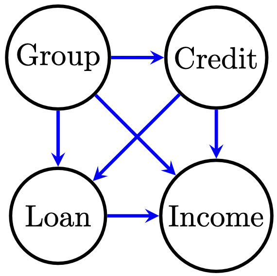
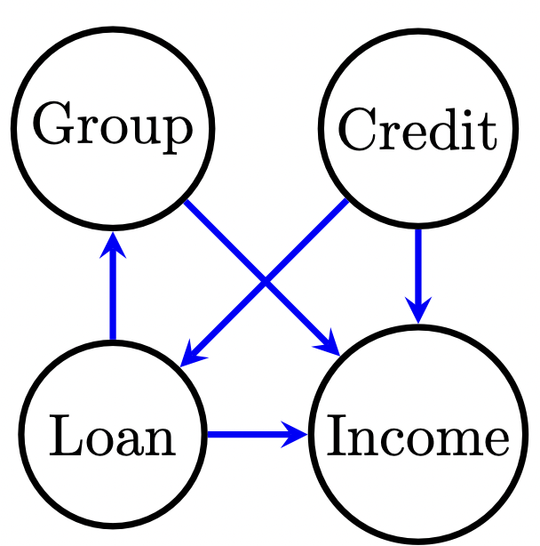
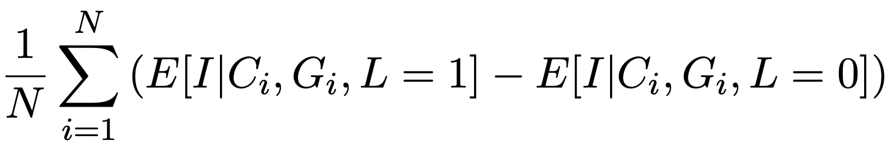
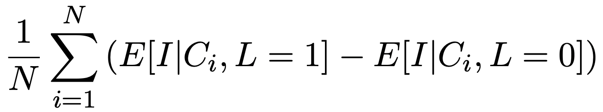

# Coding (4 points)

Your task is to implement two reinforcement learning algorithms:

1.  Multi-armed Bandits (in `code/multi_armed_bandits.py`)
1.  Q-Learning (in `code/q_learning.py`)

Your goal is to pass the test suite (contained in `tests/`). Once the tests are passed, you
may move on to the next part: reporting your results.

Your grade for this section is defined by the autograder. If it says you got an 75/100,
you get 3 points here. Suggested order for passing test_cases:

1. test_bandit_slots
2. test_bandit_frozen_lake
3. test_q_learning_slots
4. test_q_learning_frozen_lake
5. test_q_learning_deterministic

# Free-response Questions (16 Total points)
To answer some of these questions, you will have to write extra code (that is not covered by the test cases). You may (but are not required to) include your experiments in new files in the `experiments` directory. See `experiments/example.py` for an example. You can run any experiments you create within this directory with `python -m experiments.<experiment_name>`. For example, `python -m experiments.example` runs the example experiment.

## 1. (1 total points) Tic-Tac-Toe
Here we will formulate Tic-Tac-Toe as an environment in which we can train a Reinforcement Learning agent. You will play as X's, and your opponent will be O's. Two-player games such as Tic-Tac-Toe are often modeled using *game theory*, in which we try and predict the moves of our opponent as well. For simplicity, we ignore the modeling of the opponent moves and treat our opponent's actions as a source of randomness within the environment. Assume you always go first and that losses and draws are equivalent in terms of outcome.

   - a. (0.5 points) What are the states and actions within the Tic-Tac-Toe Reinforcement Learning environment? How does the current state affect the actions you can take?
   - b. (0.5 points) Design a reward function for teaching a Reinforcement Learning agent to play optimally in the Tic-Tac-Toe environment. Your reward function should specify a reward value for each of the 3 possible ways that a game can end (win, loss, or draw) as well as a single reward value for actions that do not result in the end of the game (e.g., your starting move). For actions that do not end the game, should reward be given to your agent before or after your opponent plays?

## 2. (2 total points) Bandits vs Q-Learning
Here we will set up an experiment to train both the `MultiArmedBandit` and `QLearning` models on the `SlotMachines-v0` environment. For both models, use the default parameters (`epsilon`, `alpha`, and `gamma` for `QLearning`; `epsilon` for `MultiArmedBandit`). Use the default parameters for the `SlotMachines-v0` environment as well (`n_machines`, `mean_range`, and `std_range`). You should use the `gym.make` function to create the `SlotMachines-v0` environment. See `experiments/example.py` for an example of this. __Make sure you use the same environment object for all parts of this question__.
   - a. (0.5 points) Train 10 `MultiArmedBandit` learners, each for 100,000 steps. We will refer to each of the 10 independent trainings as one *trial*. Create one plot with 3 lines on it. Plot as the first line the `rewards` array (the second return value from the `fit` function you implemented in the code; this should be a 1D numpy array of length 100) from the first trial. For the second line, average the `rewards` arrays learned in the first 5 independent trials. The resulting averaged `rewards` array should be the element-wise average over the first 5 trials of `MultiArmedBandit` and should also be of length 100. For your third line, repeat what you did to create the second line, but this time use all 10 trials. Label each line on your plot with the number of trials that were averaged over to create the line.
   - b. (0.5 points) Now train 10 `QLearning` learners, each for 100,000 steps, on the `SlotMachines-v0` environment. Use the default values for `epsilon`, `alpha`, and `gamma`. Plot the averaged  `QLearning` `rewards` array over all 10 trials that used `QLearning` and the averaged `MultiArmedBandit` `rewards` array over all 10 trials that used `MultiArmedBandit` **on the same plot**. Make sure to label each line in your plot with its associated learner.
   - c. (0.5 points) Look at your plot from question 2.a. Why is it important that we average over multiple independent trials for the same learner? What happened to the jaggedness of the line (the variance) as the number of trials increased?
   - d. (0.5 points) Look at your plot from question 2.b. How does the reward obtained by the two learners differ on the `SlotMachines-v0` environment? Does one learner appear to be significantly better (i.e., obtain higher reward) than the other? If so, what might explain this difference in performance?

## 3. (1 total point) Exploration vs. Exploitation
   - a. (0.75 points) Set up an experiment to train the `QLearning` model on the `FrozenLake-v1` environment for two values of `epsilon`: `epsilon = 0.01` and `epsilon = 0.5`. For each value, train 10 `QLearning` learners, each for 100,000 steps (i.e., `steps=100000`), with the default values for `gamma` and `alpha`. See `test_q_learning` for an example of how to run your model on an OpenAI Gym Environment. For each value of `epsilon`, plot the `rewards` array (averaged over all 10 trials). All values of `epsilon` should be plotted on the same axis. Label each line in your plot with its associated `epsilon` value. Include your plot and answer the following questions:
   - b. (0.25 points) For which value of `epsilon` is the averaged `rewards` of the `QLearning` learner maximized on the `FrozenLake-v1` environment? Note: we are asking for the value of epsilon that produces the largest single reward value at any point along the x-axis throughout your plot. *An aside: Note that we only evaluated `epsilon` during the training process. In practice, when choosing a "best" value of epsilon, it is important to evaluate which value of epsilon maximizes reward during prediction. You can evaluate this by running your predict function for, e.g., 1000 episodes for each value of epsilon and determining which value of epsilon produced the highest average reward. For simplicity, we are omitting this step.*

## 4. (4 total points) Fair ML in the real world

Read [Joy Buolamwini and Timnit Gebru, 2018. "Gender shades: Intersectional accuracy disparities in commercial gender classification." Conference on fairness, accountability and transparency](http://proceedings.mlr.press/v81/buolamwini18a/buolamwini18a.pdf), then use it to help answer the following questions.

- a. (1 point) Buolamwini and Gebru use PPV, NPV, FPR, and FNR as metrics to measure fairness. Assuming binary labels and predictions, describe each metric as a probability, e.g. "The PPV gives the probability that the label is **BLANK** given that the model predicts **BLANK**." Assuming a ML classifier were deciding whether to grant you a loan -- would you rather have that decision made by a system with a high PPV or a high NPV? Why?

- b. (1 point) What recommendations do Buolamwini and Gebru make regarding accountability and transparency of ML systems? How does this relate to specific metrics such as PPV or FPR?

- c. (1 point) What is *intersectional* about the analysis conducted by the authors? What does that analysis show?

- d. (1 point) In Section 4.7, the authors say that their "findings ... do not appear to be confounded by the quality of sensor readings." What do they mean by "confounded" in this context? Why is it important to the thesis of this paper to check whether their findings are confounded?

## 5. (4 total points) Fair ML with a toy dataset

For this question, look at the code provided in `src/free_response_five.py`. You only need to write a small amount of code, and are not required to push this code to GitHub. The data for this problem (in `data/fairness_data.csv`) has four columns: Income, Credit, Group, and Loan. We are supposing that we want to predict whether an applicant will receive a loan based on their income and credit. Loan is a binary variable, and Income and Credit are continuous. Group is some demographic category (e.g. gender or age) which is binary in this data. We want our classifier to be fair -- it should not perform differently overall for individuals with G=0 or G=1. The provided code will train several LogisticRegression models on this data, and you will analyze these models' behavior. 

- a. (1 point) Using the definitions for PPV, NPV, FPR, and FNR from __4a__ above, implement those metrics in the `metrics()` function. Now, run `python -m src.free_response_five` and fill in the table with the metrics for each part. These metrics will be printed out in the console, not shown in the matplotlib visualization.

|Part|Model|PPV|NPV|FPR|FNR|
|---|---|---|---|---|---|
|b.| Overall | | | | |
|b.| Group 0 | | | | |
|b.| Group 1 | | | | |
|c.| Overall | | | | |
|c.| Group 0 | | | | |
|c.| Group 1 | | | | |
|d.| G=0 Overall | | | | |
|d.| G=1 Overall | | | | |

- b. (0.5 points) Look at the LogisticRegression model trained in `part_b()` and shown in the top left plot. In the visualization, the area shaded grey shows positive predictions; the area shaded red shows negative predictions.
  * To what extent does the classifier treat individuals in Group 0 differently from those in Group 1?
  * If you were applying for a loan and this classifier were making the decision, would you rather be a member of Group 0 or Group 1? Why?
  * When you look at the Overall, Group 0 and Group 1 metrics you added to the table above,
which group's metrics are most similar to that of the Overall metrics? Why?

- c. (0.5 points) Consider the LogisticRegression model trained in `part_c()` and shown in the top right plot.
Looking at the code for `part_b` and `part_c`, what's different about how this model was trained compared to the model from part __b.__?
Why *doesn't* this model's decision boundary and fairness metrics differ from those of the model in part __b.__?

- d. (1.5 points) Look at the code for both LogisticRegression models trained in `part_d()` and visualized in the bottom two plots.
  * What is different about how each of these two models were trained?
  * If you were applying for a loan and were a member of Group 0, would you rather be classified by the part __d.__ "G=0" classifier or the classifier from part __b.__? Why?
  * If you were applying for a loan and were a member of Group 1, would you rather be classified by the part __d.__ "G=1" classifier or the classifier from part __b.__? Why?

- e. (0.5 points) The US Equal Credit Opportunity Act (ECOA) forbids "credit discrimination on the basis of race, color, religion, national origin, sex, marital status, age, or whether you receive income from a public assistance program." Suppose a bank wants to use machine learning to decide whether to approve or reject a loan application, but also wants to comply with the ECOA. What additional challenges are introduced by needing to consider fairness with respect to eight protected attributes instead of just one?

## 6. (4 total points points) Causal analysis with a toy dataset

For this question, look at and run the code provided in `src/free_response_six.py`. You are not required to write any code for this problem. The data for this problem (in `data/causal_data.csv`) has the same four columns as in __5.__ above. Now, we are supposing that we want to estimate whether receiving a loan has a causal effect on one's income. Whereas in __5.__ we supposed Income was measured before Loan, now we assume that first individuals are either accepted or rejected for a loan, and then we observe their income at a later date. In this problem, Group is a binary category, but it is something that could conceivably be both a *cause* of future income and be *caused by* receiving a loan. So group could be something like "owns a home" or "has received governmental assistance."

The goal of a causal analysis is to predict a *counterfactual* random variable, such as "what would this individual's income have been if their loan application had been *randomly* approved (or rejected)?" It may be helpful to refer back to [the lecture slides on causal graphical models](https://nucs-349-fall21.github.io/lectures/cs349_causal_graphical_models.pdf) to answer the following questions.

#### For parts a, b, c, d, and e, please put your answers in the table below and include explanations in the right-most column.

|Part |Question |Graph 1 |Graph 2 |Explanation |
|---|---|---|---|---|
|a.| Confounders | | | |
|b.| Formula | | | |
|c.| Estimators | | | |
|d.| Effects | | | |
|e.| Domain knowledge | | | |

- a. (0.5 points) Consider the two following graphical models for this data. Remember that to estimate a causal effect, we typically need to conditional on all confounders — variables that are a common cause of both the treatment (Loan) and outcome (Income). For both graphs, list in the table above all confounders for the causal effect of Loan on Income: Group, Credit, both Group and Credit, or neither. When considering each graph, assume (for now) that the graph is correct and there are no other relevant variables other than the four included in each graph. For each answer, explain your reasoning in terms of paths in the graph.

|Graph 1 |Graph 2 |
|---|---|
|  |  |

- b. (1 point) Remember that when we considered Simpson's Paradox (slides 8-11 in the lecture slides), we had two different ways of computing a causal effect that depended on the underlying assumptions we made about the data. Because income (and credit) are continuous, we cannot easily represent these formulas as a table as we did in lecture when our outcome (recovery rate) was a binary variable. Instead, we use a difference in conditional expected values in each of two formulas for computing the "average causal effect" of loan approval on income. Which formula below corresponds to which causal graph above? Explain your answer.

|Formula 1 |Formula 2 |
| --- | --- |
|  |  |

- c. (0.5 points) Consider the two estimator functions implemented in `estimator_one()` and `estimator_two()` in `src/free_response_six.py`. Each fits a linear regression model on the data to model the relationship between income and the other variables. Compare these to the Formulas in __b.__ above. Which estimator implements which formula? Put "Estimator X" in the same column as "Formula Y" if estimator X implements formula Y. Explain your answer.

- d. (1 point) Run `python -m src.free_response_six`. Describe the results: how do these two estimates of the causal effect differ?

- e. (1 point) Consider the column corresponding to each causal graph above. Each graph implies a set of confounders, which implies a formula for estimating causal effects, which leads to an estimator, which leads to an estimate. Graph 1 and Graph 2 only differ on a few edges, and yet we see from part __d__ that we get different results depending on which graph we choose. Suppose you aren't sure if Graph 1 or Graph 2 is correct, and you want to talk to a domain expert to decide which is a more realistic representation of these four variables. What domain knowledge would convince you that Graph 1 is a better model than Graph 2? What domain knowledge could convince you that Graph 2 is a better model than Graph 1?
